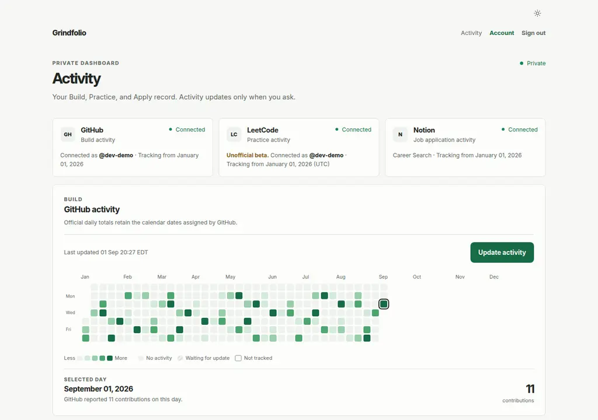
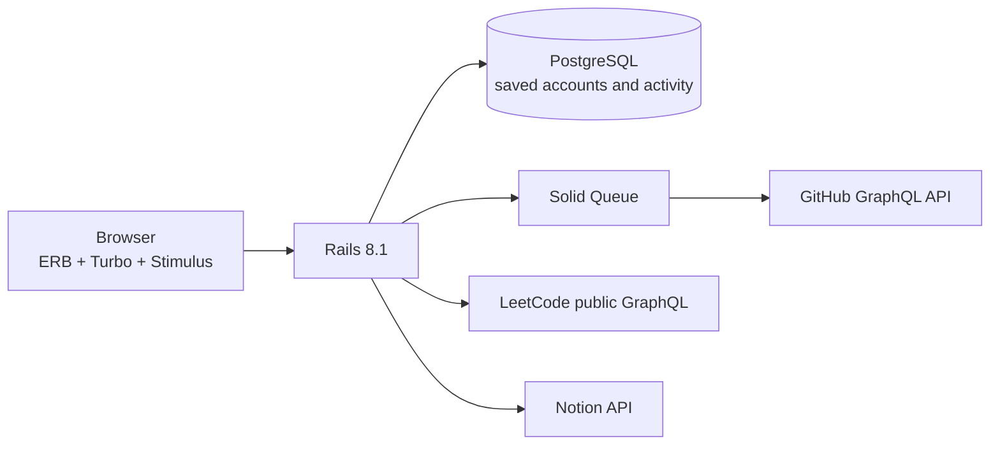
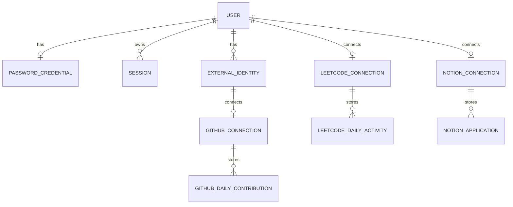

# Grindfolio

**The developer grind is more than writing code. It is learning, building, practising, and applying day after day, even when progress feels slow.**

I built Grindfolio to help professionals, students, and job seekers see their daily progress in one place, stay accountable, and feel encouraged by the progress they are making.

> **Status:** Grindfolio is a private beta and portfolio project. This repository is available for recruiters and other reviewers to see how it was built. The app is not yet publicly hosted and is not intended to be self-hosted.

## What it tracks

| Area | Source | What counts | Date used |
| --- | --- | --- | --- |
| **Build** | GitHub | GitHub's official contribution total for the day | The date shown by GitHub |
| **Practice** | LeetCode | Every submission, whether accepted or not | LeetCode's UTC date |
| **Apply** | Notion | Each application with an application date | The date saved in Notion |

## Tracking and updates

Each service starts tracking on its own. GitHub and Notion start on the day they are connected, while LeetCode starts on the day the username is verified. Grindfolio treats that starting date as a full day.

GitHub and LeetCode do not load activity from before tracking started. Notion follows the same rule unless someone chooses to import earlier applications from the current dashboard year.

Updates happen only when someone asks for them. If they return after a few days and press **Update**, Grindfolio fills in the available activity for that service. GitHub checks the past 30 days, LeetCode checks the current UTC year, and Notion rereads the connected tracker. Updating again corrects saved activity instead of adding duplicates. If one update fails, the last saved data remains and the other services continue to work.

## Product experience

- A private dashboard with separate Build, Practice, and Apply heatmaps for the same year.
- Clear differences between dates that were not tracked, dates waiting for an update, dates with no activity, and dates with activity.
- Selected-day details, including the company, role, and status of Notion applications.
- No request to an outside service when someone signs in or opens the dashboard.
- An account time zone for choosing the dashboard year without changing the dates supplied by each service.
- System, light, and dark themes saved in the browser.

## Architecture

Rails handles accounts, service connections, updates, and page rendering. PostgreSQL stores the dashboard data so the page does not have to wait for GitHub, LeetCode, or Notion. GitHub updates run in the background through Solid Queue.

### Simplified data model

Account details, sign-in methods, sessions, and service connections are kept separate. GitHub and LeetCode totals are saved by date, while Notion applications keep the details shown when someone selects a day.

## Technology

| Layer | Choice |
| --- | --- |
| Application | Ruby 3.4, Rails 8.1 |
| Front end | ERB, Turbo, Stimulus, Importmap |
| Database | PostgreSQL 18, Active Record Encryption |
| Background jobs | Active Job, Solid Queue |
| Account security | bcrypt passwords, signed email links, database-backed sessions |
| Tests and checks | Minitest, RuboCop, Brakeman, Bundler Audit, Importmap Audit |

I chose a server-rendered Rails app because most of the work happens around accounts, outside services, saved activity, and background jobs. Hotwire updates the parts of the dashboard that change without requiring a separate front-end application.

## Quality

Tests cover accounts, service connections, activity updates, background jobs, dashboard data, email flows, and full request flows. The `bin/ci` command runs the Rails tests, checks Ruby style, scans the code with Brakeman, and checks dependencies for known security issues.

## Service notes and limits

- **GitHub:** Grindfolio uses GitHub's official contribution calendar. It can include private contribution totals when someone allows it, but it never requests or displays private repository details.
- **Notion:** Grindfolio currently works with one Internship Application Tracker layout. It reads only the company, application date, role, and status used by the dashboard.
- **LeetCode:** This is an unofficial beta connection. Grindfolio is not affiliated with or endorsed by LeetCode. It uses an undocumented public connection that may change or stop working, and it never sends LeetCode passwords or cookies. The connection must be reviewed again before it is offered publicly.
- **Privacy:** There is no public profile or recruiter view inside Grindfolio. Account and activity information is visible only to the person who signed in.

## Future work

- Decide what happens to saved activity when a service is disconnected.
- Add account deletion with clear confirmation and permanent data removal.
- Finish support for long gaps and new calendar years.
- Support more Notion job application tracker layouts.
- Explore an optional reward system with streaks and milestones for completing all three areas in a day or staying consistent over time.
- Explore optional ways to share progress while keeping accounts private by default.
